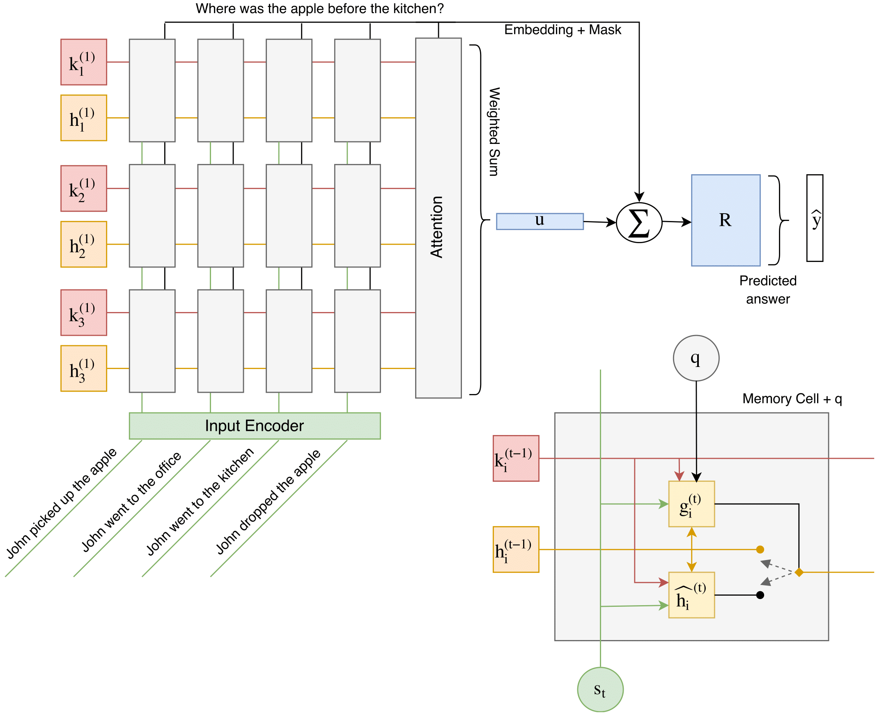

# Question Dependent Recurrent Entity Network (QDREN)
This is a TensorFlow implementation of the Question Dependent Recurrent Entity Network (QDREN), which is a customization of the original Recurrent Entity Network [Henaff]. In QDREN we basically modified the infrastructure of the original gating function, by taking in consideration the question in input. Further details about the model will be available soon, the following figure show the produced model. We tested our model using 2 datasets: bAbI tasks [Peng] with 1K samples, and CNN news article [Hermann]. In the bAbI task 1K sample we successfully passed 12 tasks.

Different implementations of the original Recurrent Entity Network are available online. The original that uses Torch 7 is available [here](https://github.com/facebook/MemNN/tree/master/EntNet-babi), and another one which also uses TensorFlow is available [here](https://github.com/jimfleming/recurrent-entity-networks).

## Datasets
The data used for the experiments are available at:
- [FAIR](https://research.fb.com/downloads/babi/) for the bAbI tasks
- [http://cs.stanford.edu/~danqi/data/cnn.tar.gz](http://cs.stanford.edu/~danqi/data/cnn.tar.gz), and the original one from [https://github.com/deepmind/rc-data](https://github.com/deepmind/rc-data ) for the CNN news article

## Reference 

- [Henaff] Henaff, Mikael, et al. "Tracking the World State with Recurrent Entity Networks." arXiv preprint arXiv:1612.03969 (2016)

- [Peng] Peng, Baolin, et al. "Towards neural network-based reasoning." arXiv preprint arXiv:1508.05508 (2015).

- [Hermann]  Hermann, Karl Moritz, et al. "Teaching machines to read and comprehend." Advances in Neural Information Processing Systems. 2015.
