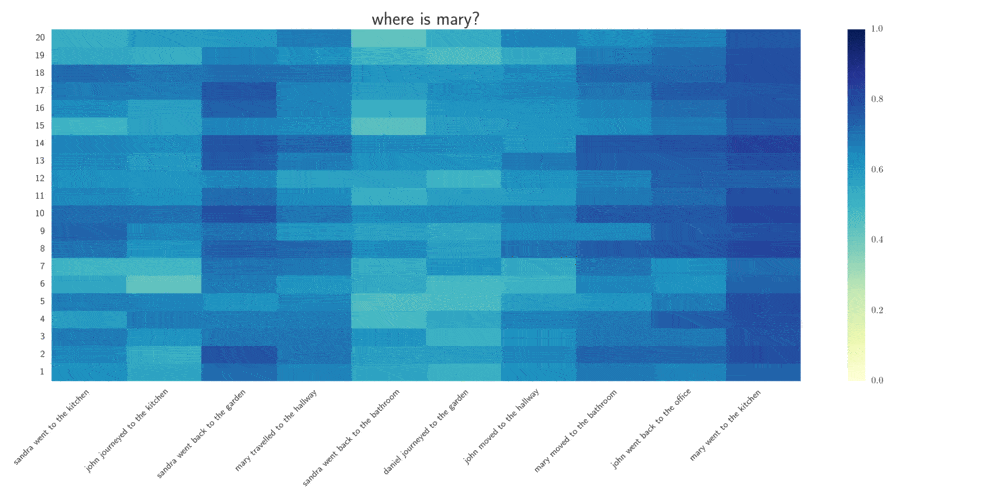

# Question Dependent Recurrent Entity Network (QDREN)
This is a TensorFlow implementation of the Question Dependent Recurrent Entity Network (QDREN), which is a model based on the Recurrent Entity Network [Henaff]. We named our model Question Dependent Recurrent Entity Network since our main contribution is to include the question into the memorization process. The following figure shows an overview of the QDREN model. We tested our model using 2 datasets: bAbI tasks [Peng] with 1K samples, and CNN news article [Hermann]. In the bAbI task 1K sample, we successfully passed 12 tasks.

<p align="center">

</p>


Different implementations of the original Recurrent Entity Network are available online. The original, that uses Torch 7, is available [here](https://github.com/facebook/MemNN/tree/master/EntNet-babi), and another one which also uses TensorFlow, and helped a lot in our implementation, is available [here](https://github.com/jimfleming/recurrent-entity-networks).

## Citation
If you wish to reuse the QDREN model, please properly cite the following paper:
```
 @article{madotto2017question,
  title={Question Dependent Recurrent Entity Network for Question Answering},
  author={Madotto, Andrea and Attardi, Giuseppe},
  journal={arXiv preprint arXiv:1707.07922},
  year={2017}
}
```

## Datasets
The data used for the experiments are available at:
- [FAIR](https://research.fb.com/downloads/babi/) for the bAbI tasks
- [http://cs.stanford.edu/~danqi/data/cnn.tar.gz](http://cs.stanford.edu/~danqi/data/cnn.tar.gz) already preprocessed, and the original one from [https://github.com/deepmind/rc-data](https://github.com/deepmind/rc-data ) for the CNN news article

The dataset must be downloaded and save it in the data folder (on the right data folder). Moreover, you have to download in the data folder the glove embeddings ([http://nlp.stanford.edu/data/glove.6B.zip](http://nlp.stanford.edu/data/glove.6B.zip)) 

## User guide
### Dependency 
I run the code using Python 2.7 but should also work with Python 3. Then the following python package must be installed:

```python
pip install numpy
pip install tensorflow
pip install tflearn
pip install logging
pip install sklearn
pip install scipy
pip install pandas
pip install seaborn
pip install matplotlib
pip install tqdm
pip install imageio
```
### How to run the code
The code is separated into two folders depending on which dataset we are running. In both folders, we have a file for running the model selection `run.py` and one to test the model `run_final.py`. The latter trains the model with the best hyper-parameters and at the same time checks the accuracy of the test set at each epoch.

In the `run.py` is possible to select which hyper-parameters to test. For instance adding parameters in this dic:

```python
    param_grid = {'nb': [20], ## number of memory blocks 
                  'lr': [0.01,0.001,0.0001],
                  'tr': [[1,1,0,0]], ## mask => [pretrain_emb,train/no_train, None, None]
                  'L2': [0.001,0.0001],
                  'bz': [64], ## batch size
                  'dr': [0.5],
                  'mw': [150], ## number of window / or sentences in case the input are sents
                  'w' : [3,4,5], ## window size
                  'op': ['Adam']
                  }
```

In case you wanna run the original Entity Network you need to change the import in 'src/EN.py' from `from memories.DMC_query import DynamicMemoryCell` to simply `from memories.DMC import DynamicMemoryCell`.

Moreover, if you run the bAbi task you need to select which task to run. For example, to run task 3:

```python
python run.py 3
```

### Visualization
In case you are running the bAbI task, you can visualize the activation of the gating function. In it is enough to add a plot folder in the data folder. Then each 10 epoch you will see a pdf file showing the plot. Until now I suggest to use it with a task with no more than 10 sentences, else the label in y-axes will overlap. By default, the visualization is done with the last Validation sample. There is also a script for creating a gif with the saved images. An example of the visualization is shown in the following (Task 1 bAbI).

**Question Dependent Recurrent Entity Network**


**Recurrent Entity Network**


Heatmap representing the gating function result for each memory block. In the y-axes represents the memory block number (20 in this example), in the x-axes, there are the sentences in the input divided into time steps, and at the top, there is the question to be answered. Darker colour means a gate more open (values close to 1) and lighter colour means the gate less open

## Results 

### bAbI 1K
Comparisons between n-gram, LSTM, QDREN, REN and End To End Memory Network (MemN2N). All the results have been taken from the original articles where they were first presented. In bold we highlight the task in which we greatly outperform the other models.

| **Task** | **n-gram** | **LSTM** | **MemN2N** | **REN** | **QDREN** |
|:--------:|:----------:|:--------:|:----------:|:-------:|:---------:|
|     1    |    64.0    |   50.0   |     0.0    |   0.7   |    0.0    |
|     2    |    98.0    |   80.0   |     8.3    |   56.4  |    67.6   |
|     3    |    93.0    |   80.0   |    40.3    |   69.7  |    60.8   |
|     4    |    50.0    |   39.0   |     2.8    |   1.4   |    0.0    |
|     5    |    80.0    |   30.0   |    13.1    |   4.6   |  **2.0**  |
|     6    |    51.0    |   52.0   |     7.6    |   30.0  |    29.0   |
|     7    |    48.0    |   51.0   |    17.3    |   22.3  |  **0.7**  |
|     8    |    60.0    |   55.0   |    10.0    |   19.2  |  **2.5**  |
|     9    |    38.0    |   36.0   |    13.2    |   31.5  |  **4.8**  |
|    10    |    55.0    |   56.0   |    15.1    |   15.6  |  **3.8**  |
|    11    |    71.0    |   28.0   |     0.9    |   8.0   |    0.6    |
|    12    |    91.0    |   26.0   |     0.2    |   0.8   |    0.0    |
|    13    |    74.0    |    6.0   |     0.4    |   9.0   |  **0.0**  |
|    14    |    81.0    |   73.0   |     1.7    |   62.9  |    15.8   |
|    15    |    80.0    |   79.0   |     0.0    |   57.8  |  **0.3**  |
|    16    |    57.0    |   77.0   |     1.3    |   53.2  |    52.0   |
|    17    |    54.0    |   49.0   |    51.0    |   46.4  |    37.4   |
|    18    |    48.0    |   48.0   |    11.1    |   8.8   |    10.1   |
|    19    |    10.0    |   92.0   |    82.8    |   90.4  |    85.0   |
|    20    |    24.0    |    9.0   |     0.0    |   2.6   |    0.2    |
|  Failed Tasks (≥ 5%)    |     20     |    20    |     11     |    15   |     8     |
|  Mean Error:     |    65.9    |   50.8   |    13.9    |   29.6  |    18.6   |

### Cnn news article 
To check whether our QDREN could improve the existent REN and whether the window-based approach makes any difference in comparison with plain sentences, we separately trained four different models:

-   **REN + SENT**: original model with sentences as input

-   **REN + WIND**: original model using the window-based input

-   **QDREN + SENT**: our proposed model with sentences as input

-   **QDREN + WIND**: our proposed model using window-based input

Then we also compare our results with Max Freq., Frame-semantic model, Word distance, Standford Attentive Reader (AR), LSTM reader (LSTM), Attentive Reader, End To End Memory Network (MemN2N), and Attention Over Attention (AoA). All the results have been taken from the original articles where they were first presented.

|              | **REN+SENT** |   **REN+WIND**  | **QDREN+SENT** | **QDREN+WIND** |
|-------------:|:------------:|:---------------:|:--------------:|:--------------:|
|  *Validation*|     42.0     |       38.0      |      39.9      |      59.1      |
|        *Test*|     42.0     |       40.1      |      39.7      |      62.8      |
|              |   **Max Freq.**   | **Frame-semantic** |   **Word distance**   |     **Standford AR**    |
|  *Validation*|     30.5     |       36.3      |      50.5      |      72.5      |
|        *Test*|     33.2     |       40.2      |      50.9      |      72.7      |
|              |   **LSTM**   | **Att. Reader** |   **MemN2N**   |     **AoA**    |
|  *Validation*|     55.0     |       61.6      |      63.4      |      73.1      |
|        *Test*|     57.0     |       63.0      |      66.8      |      74.4      |
## Reference 

- [Henaff] Henaff, Mikael, et al. "Tracking the World State with Recurrent Entity Networks." arXiv preprint arXiv:1612.03969 (2016)

- [Peng] Peng, Baolin, et al. "Towards neural network-based reasoning." arXiv preprint arXiv:1508.05508 (2015).

- [Hermann]  Hermann, Karl Moritz, et al. "Teaching machines to read and comprehend." Advances in Neural Information Processing Systems. 2015.
